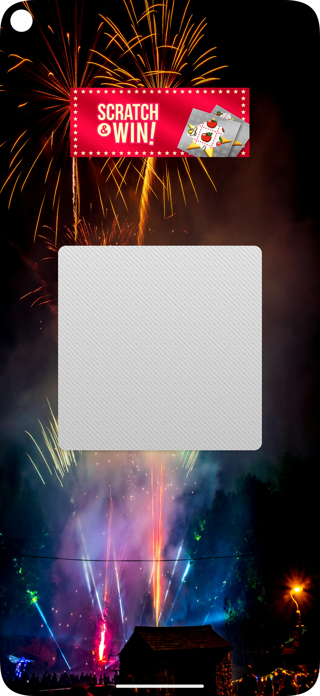
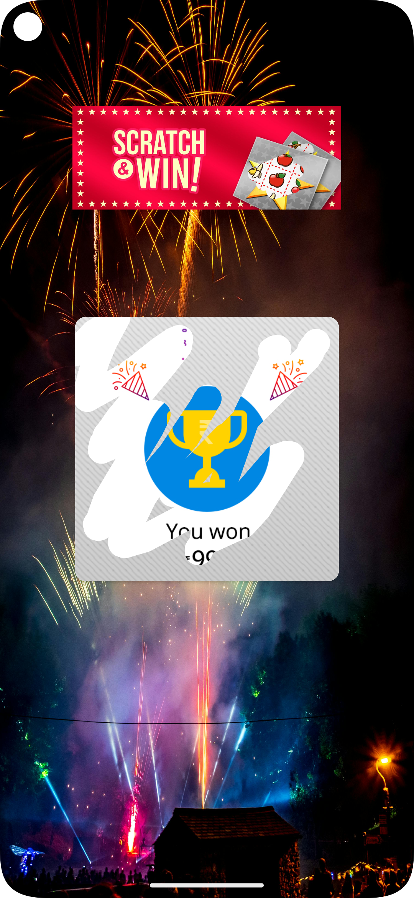
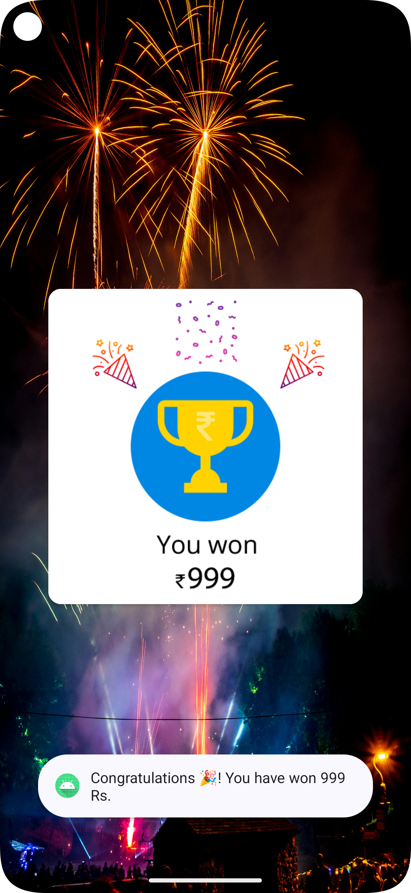

# 🎯 ScratchView - Scratch to Reveal Android Application

An interactive Android application where users can scratch a surface to reveal hidden rewards using `ScratchImageView`. Designed with engaging animations and smooth UI for an immersive experience.

## ✨ Features

- 🪄 **Scratch to Reveal** functionality using `ScratchImageView`
- 🎉 **Reward Reveal Animation** with scaling and transition effects
- ✅ Auto-reveal after 60% scratch
- 🧩 Modular code for easy customization
- 💬 Instant feedback with Toast messages

---

# 📱 Screenshots

  
  
  

---

## 🔧 Tech Stack

- **Language:** Java  
- **IDE:** Android Studio  
- **Minimum SDK:** 21  
- **Dependency:**
- 
  **groovy**
  implementation 'com.github.cooltechworks:ScratchView:v1.1'

🚀**How it Works**

Scratch the image overlay using finger gestures

When 60% area is scratched, it auto-completes the reveal

A congratulatory message is shown

A scale animation plays to highlight the reward

🛠️ **Setup Instructions**

Clone this repository:

git clone https://github.com/AkashYadav8080/ScratchView.git

Open in Android Studio

Build the project and run on emulator or device

🤝 **Contribution**

Feel free to fork, improve, or open issues. All contributions are welcome!

📄 **License**
This project is open-sourced under the MIT License.

---
🔗 **Credits**
https://github.com/sharish/ScratchView
